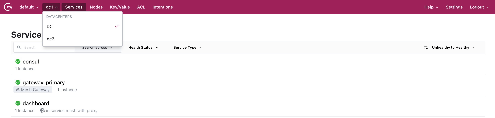
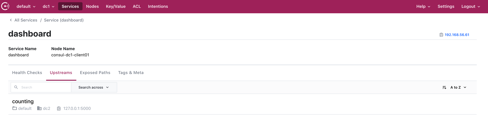
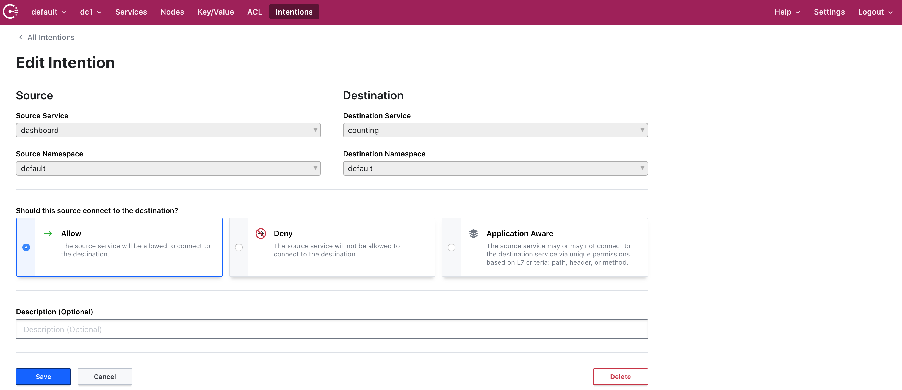

## This repo contains a sample Vagrant project of Consul cluster in multi-datacenter deployment with mesh gateways for inter-datacenter communication. 

#### The usage is pretty simple

- At least 8GB ram
- Vagrant should be [installed](https://www.vagrantup.com/)
- Git should be [installed](https://git-scm.com/)
- [Consul](https://www.consul.io/) installed. If we need more servers, clients or a specific Consul version - it is simple as just change the numbers in the Vagrantfile
```
SERVER_COUNT = 1
CLIENT_COUNT = 2
VAULT_COUNT = 1
VAULT_VERSION = '1.5.5'
CONSUL_VERSION = '1.9.1+ent'
CONSUL_TEMPLATE_VERSION = '0.25.1'
ENVCONSUL_VERSION = '0.10.0'
DOMAIN = 'consul'
TLS_ENABLE = true
```

### To start, just follow the steps:

- Clone the repo
```
git clone https://github.com/chavo1/vagrant-consul-mesh.git
cd vagrant-consul-mesh
```
- Start the lab
```
vagrant up
```
#### Check if Consul UI is available on the following addresses:
##### DC1
- Servers: https://192.168.56.51:8501 etc.
- Clients: https://192.168.56.61:8501 etc.
##### DC2
- Servers: https://192.168.57.51:8501 etc.
- Clients: https://192.168.57.61:8501 etc.

##### Services
- Counting http://192.168.57.61:9003/

- Dashboard http://192.168.56.61:9002/

#### Apply license

```
consul license put @/vagrant/consul.hclic
```

#### Secure Service Communication with Consul Service Mesh according to the following articles:

- https://learn.hashicorp.com/tutorials/consul/service-mesh-with-envoy-proxy
- https://learn.hashicorp.com/tutorials/consul/service-mesh-gateways

##### Consul UI


##### Services


##### Consul intentions


